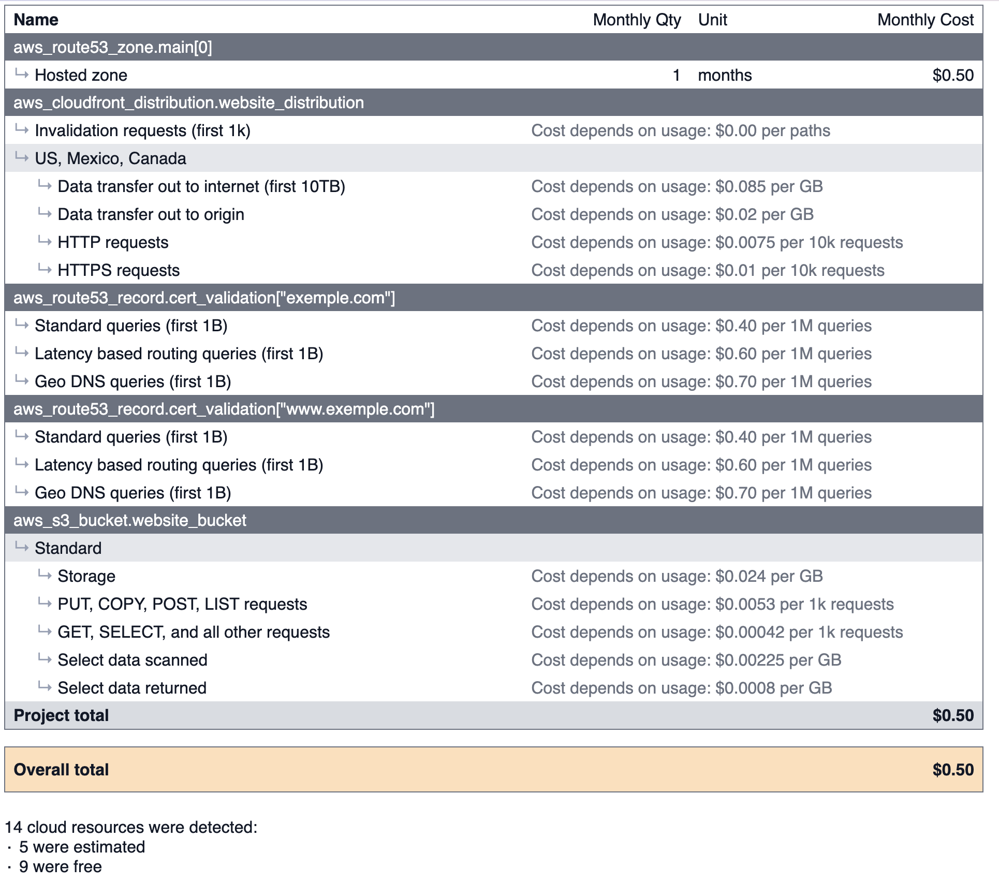

<!-- BEGIN_TF_DOCS -->

## Coût infrastructure

## Requirements

No requirements.

## Providers

| Name | Version |
|------|---------|
|  [aws](#provider\_aws) | 5.92.0 |
|  [aws.us-east-1](#provider\_aws.us-east-1) | 5.92.0 |

## Modules

No modules.

## Resources

| Name | Type |
|------|------|
| [aws_acm_certificate.ssl_certificate](https://registry.terraform.io/providers/hashicorp/aws/latest/docs/resources/acm_certificate) | resource |
| [aws_acm_certificate_validation.cert_validation](https://registry.terraform.io/providers/hashicorp/aws/latest/docs/resources/acm_certificate_validation) | resource |
| [aws_cloudfront_distribution.website_distribution](https://registry.terraform.io/providers/hashicorp/aws/latest/docs/resources/cloudfront_distribution) | resource |
| [aws_cloudfront_origin_access_identity.oai](https://registry.terraform.io/providers/hashicorp/aws/latest/docs/resources/cloudfront_origin_access_identity) | resource |
| [aws_route53_record.cert_validation](https://registry.terraform.io/providers/hashicorp/aws/latest/docs/resources/route53_record) | resource |
| [aws_route53_record.website_a](https://registry.terraform.io/providers/hashicorp/aws/latest/docs/resources/route53_record) | resource |
| [aws_route53_record.website_www_a](https://registry.terraform.io/providers/hashicorp/aws/latest/docs/resources/route53_record) | resource |
| [aws_route53_zone.main](https://registry.terraform.io/providers/hashicorp/aws/latest/docs/resources/route53_zone) | resource |
| [aws_s3_bucket.website_bucket](https://registry.terraform.io/providers/hashicorp/aws/latest/docs/resources/s3_bucket) | resource |
| [aws_s3_bucket_ownership_controls.website_bucket_ownership](https://registry.terraform.io/providers/hashicorp/aws/latest/docs/resources/s3_bucket_ownership_controls) | resource |
| [aws_s3_bucket_policy.website_bucket_policy](https://registry.terraform.io/providers/hashicorp/aws/latest/docs/resources/s3_bucket_policy) | resource |
| [aws_s3_bucket_public_access_block.website_bucket_public_access](https://registry.terraform.io/providers/hashicorp/aws/latest/docs/resources/s3_bucket_public_access_block) | resource |
| [aws_s3_bucket_website_configuration.website_config](https://registry.terraform.io/providers/hashicorp/aws/latest/docs/resources/s3_bucket_website_configuration) | resource |

## Inputs

| Name | Description | Type | Default | Required |
|------|-------------|------|---------|:--------:|
|  [aws\_region](#input\_aws\_region) | Région AWS où déployer les ressources | `string` | `"eu-west-3"` | no |
|  [bucket\_name](#input\_bucket\_name) | Nom du bucket S3 pour héberger le site web | `string` | n/a | yes |
|  [create\_route53\_zone](#input\_create\_route53\_zone) | Créer une nouvelle zone Route 53 (true) ou utiliser une zone existante (false) | `bool` | `false` | no |
|  [domain\_name](#input\_domain\_name) | Nom de domaine pour le site web | `string` | n/a | yes |
|  [route53\_zone\_id](#input\_route53\_zone\_id) | ID de la zone Route 53 existante (si create\_route53\_zone = false) | `string` | `""` | no |

## Outputs

| Name | Description |
|------|-------------|
|  [cloudfront\_distribution\_id](#output\_cloudfront\_distribution\_id) | ID de la distribution CloudFront |
|  [cloudfront\_domain\_name](#output\_cloudfront\_domain\_name) | Nom de domaine CloudFront |
|  [route53\_name\_servers](#output\_route53\_name\_servers) | Serveurs de noms pour la zone Route 53 (si créée) |
|  [website\_bucket\_arn](#output\_website\_bucket\_arn) | ARN du bucket S3 |
|  [website\_bucket\_name](#output\_website\_bucket\_name) | Nom du bucket S3 hébergeant le site web |
|  [website\_endpoint](#output\_website\_endpoint) | Endpoint du site web S3 |
<!-- END_TF_DOCS -->